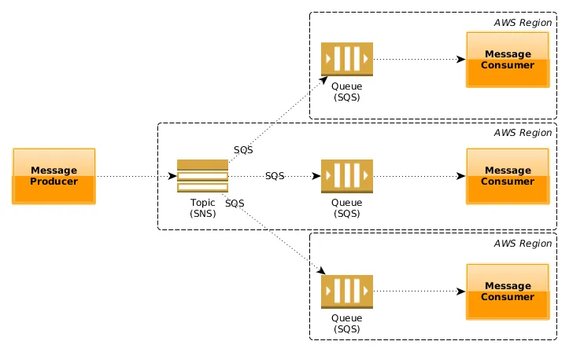
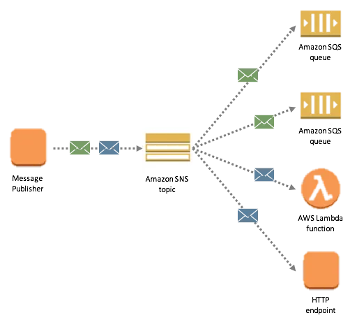
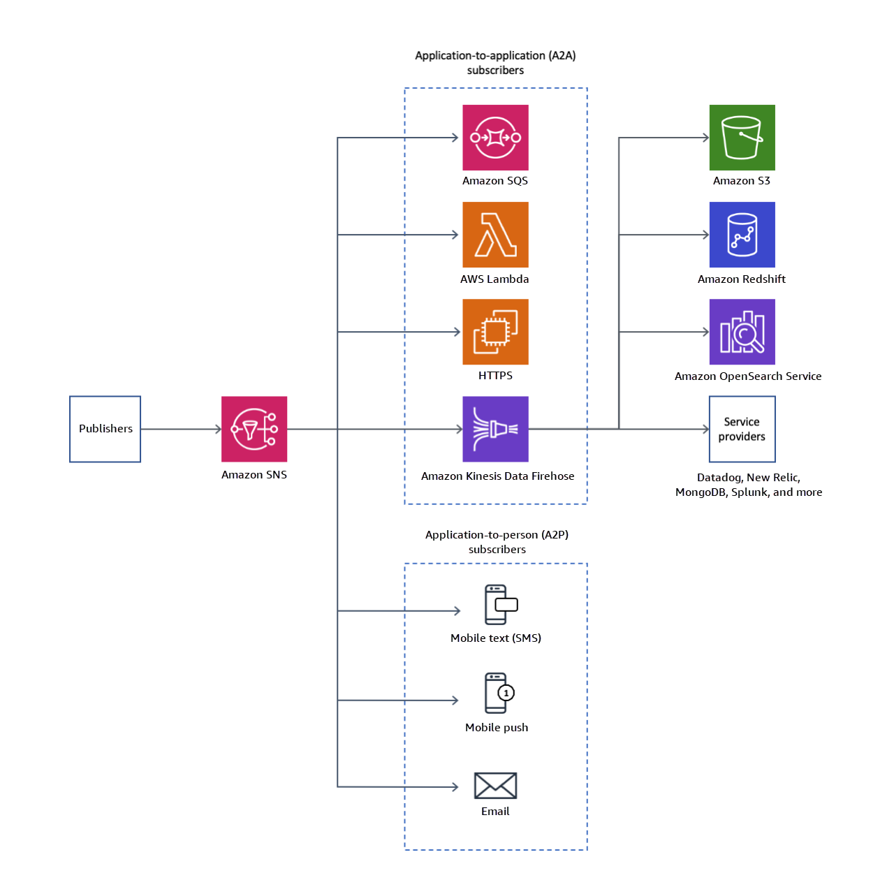

# springboot-aws-sns
Amazon Simple Notification Service Pub/sub messaging for microservices and serverless applications.

### AWS — Simple Notification Service and Simple Queue Service

SNS is a distributed publish-subscribe service.
SQS is distributed queuing service.

### AWS SNS (Simple Notification Service)

### Features
1. Amazon SNS is a fast, flexible, fully managed push notification service that lets you send individual messages or to bulk messages to large numbers of recipients. Amazon SNS makes it simple and cost effective to send push notifications to mobile device users, email recipients or even send messages to other distributed services.
2. SNS is a distributed publish-subscribe system. Messages are pushed to subscribers as and when they are sent by publishers to SNS.
3. SNS supports several end points such as email, sms, http end point and SQS. If you want unknown number and type of subscribers to receive messages, you need SNS.
4. With Amazon SNS, you can send push notifications to Apple, Google, Fire OS, and Windows devices , as well as to Android devices in China with Baidu Cloud Push. You can use SNS to send SMS messages to mobile device users in the US or to email recipients worldwide.

### Spring Boot Use-Cases for AWS SNS
There are many areas where you could use SMS, email, or HTTP/S notifications in a Spring Web application:

1. Notify all microservices of an application-wide event.
2. Notify admins/developers that of critical errors or downed services.
3. Phone number verification via OTP (One-Time Password) during user registration or password reset.
4. Notify users of an event that is directly associated with the user (ex: an application is accepted).
5. Increase user engagement as email and SMS notifications can bring the user back to your application._

