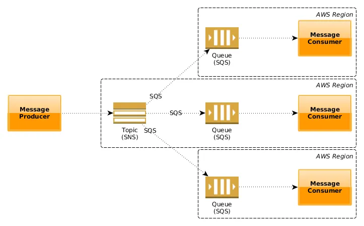

# springboot-aws-sqs
Amazon SQS ( Simple Queue Service )

### Simple Notification Service and Simple Queue Service.

### SQS (Simple Queue Service)

1. Amazon SQS is a fully managed message queuing service that enables you to decouple and scale microservices, distributed systems, and serverless applications.
2. SQS is distributed queuing system. Messages are not pushed to receivers. Receivers have to poll SQS to receive messages. Messages can be stored in SQS for short duration of time (max 14 days).
3. Messages can’t be received by multiple receivers at the same time. Any one receiver can receive a message, process and delete it. Other receivers do not receive the same message later. Polling inherently introduces some latency in message delivery in SQS unlike SNS where messages are immediately pushed to subscribers.

### Key Differences
#### Entity Type
SQS : Queue (similar to JMS, MSMQ).
SNS : Topic-Subscriber (Pub/Sub system).

#### Message consumption
SQS : Pull Mechanism — Consumers poll messages from SQS.
SNS : Push Mechanism — SNS pushes messages to consumers.

#### Persistence
SQS : Messages are persisted for some duration is no consumer available. The retention period value is from 1 minute to 14 days. The default is 4 days.
SNS : No persistence. Whichever consumer is present at the time of message arrival, get the message and the message is deleted. If no consumers available then the message is lost.

In SQS the message delivery is guaranteed but in SNS it is not.

### Consumer Type
SQS : All the consumers are supposed to be identical and hence process the messages in exact same way.
SNS : All the consumers are (supposed to be) processing the messages in different ways.

## Use Cases
### Choose SNS if:
You would like to be able to publish and consume batches of messages.
You would like to allow same message to be processed in multiple ways.
Multiple subscribers are needed.

### Choose SQS if:
You need a simple queue with no particular additional requirements.
Decoupling two applications and allowing parallel asynchronous processing.
Only one subscriber is needed.

### Summary
SQS is mainly used to decouple applications. SNS distributes several copies of a message to several subscribers.

